# Squad System Framework

> 분대 시스템 기반 3인칭 RPG 개발 문서

---

## 1. 프로젝트 소개

### 1.1 게임 개요

**Squad System Framework**는 **분대 시스템 기반 3인칭 RPG 프레임워크**입니다.

- **플레이어·동료 분대**: 한 명을 조종하고, 나머지는 AI가 따라오며 전투에 참여
- **분대 교체(Swap)**: 조종 대상을 순환 전환
- **동료 영입**: 퀘스트 완료 시 NPC를 분대에 영입
- **적 전투**: 분대 vs 적 팀, 어그로, 처치 퀘스트 연동
- **대화**: NPC 상호작용, 플래그 기반 대화 분기
- **퀘스트**: 수집·처치·영입, 진행도·완료 분기
- **인벤토리**: 아이템 수집·보관
- **아이템 사용**: 회복 아이템 등, 조종 중인 캐릭터에 적용
- **포탈·맵**: 근접 이펙트, 해금 아이콘 표시, 지도 클릭 순간이동, 스크롤·줌
- **사망·리스폰**: 마을 고정 위치에서 부활
- **세이브/로드**: 분대 구성, 퀘스트, 인벤토리, 플래그, 캐릭터 위치·조종 캐릭터 저장

### 1.2 게임 이미지

<table>
<tr>
<td><strong>인트로</strong> 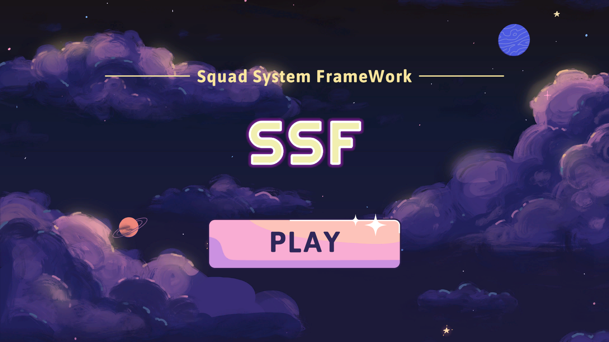</td>
<td><strong>분대 따라오기</strong> 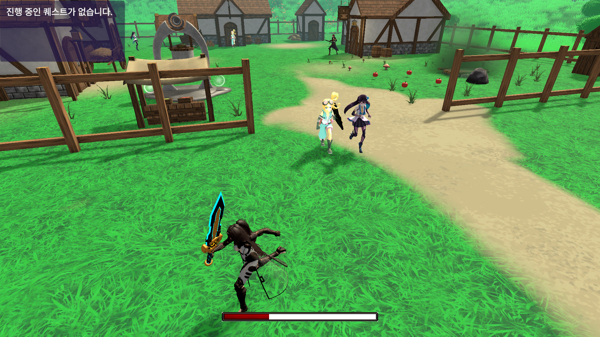</td>
</tr>
<tr>
<td><strong>분대 전투</strong> 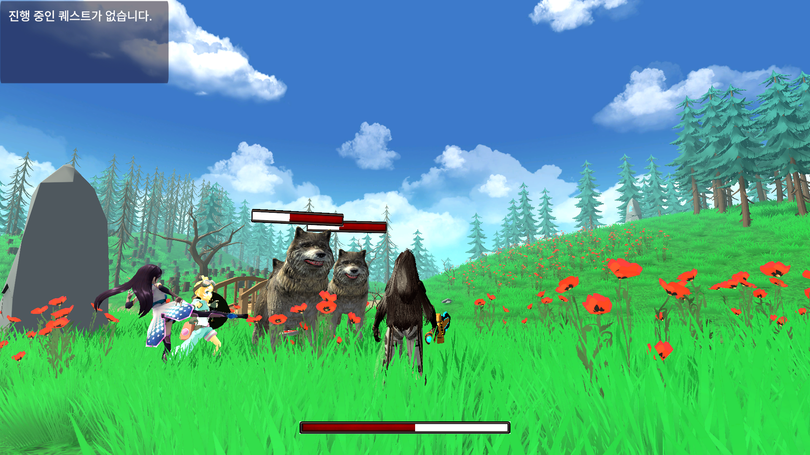</td>
<td><strong>대화·퀘스트</strong> 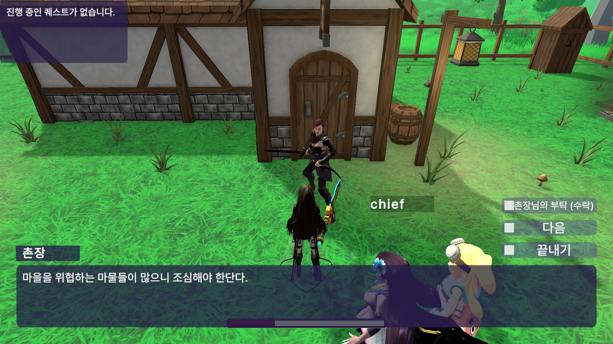</td>
</tr>
<tr>
<td><strong>동료 영입 완료</strong> 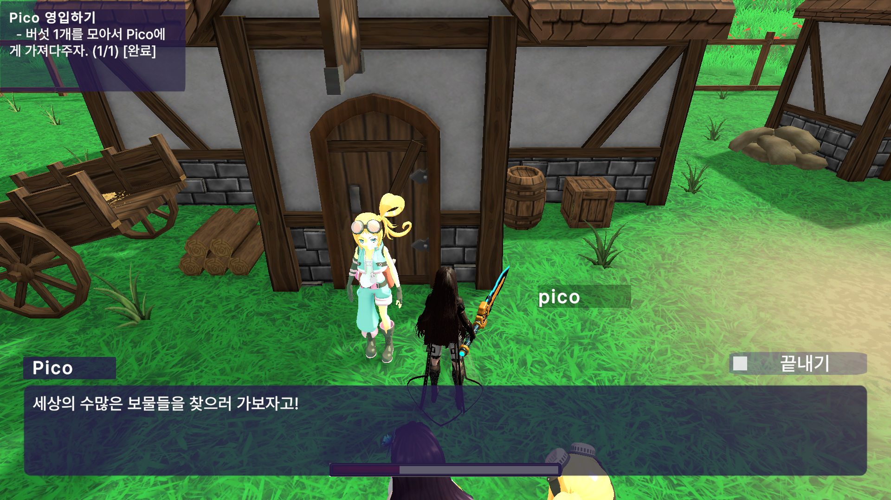</td>
<td><strong>인벤토리</strong> 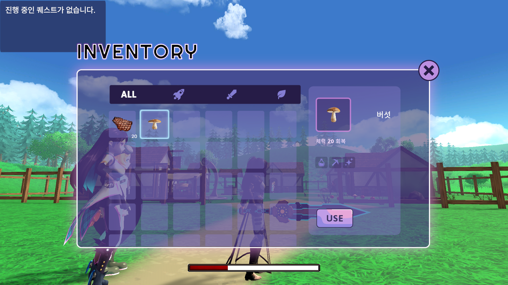</td>
</tr>
<tr>
<td><strong>지도</strong> 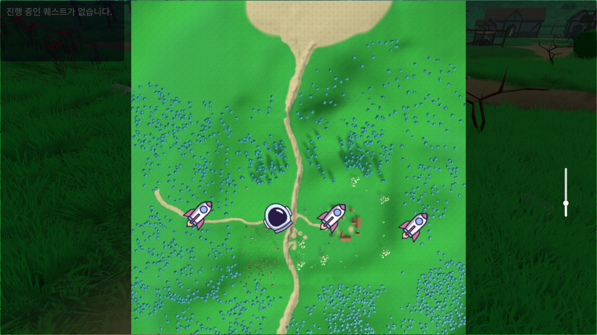</td>
<td><strong>포탈</strong> 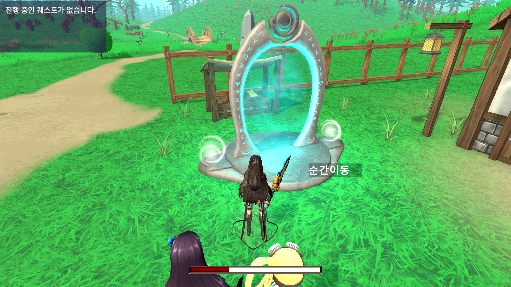</td>
</tr>
</table>

### 1.3 영상

[🎬 영상 보기](https://youtu.be/l2WycMeBfec)

---

## 2. 핵심 기술 항목

### 2.1 분대·캐릭터 통합 상태머신

#### 도식

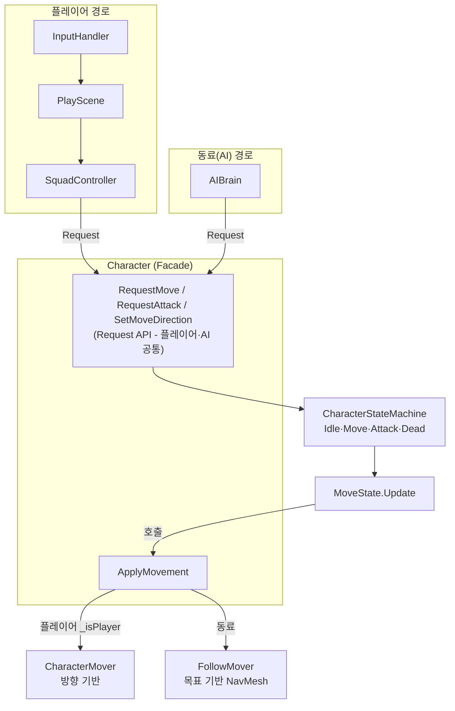
```mermaid
flowchart TB
    subgraph PlayerPath["플레이어 경로"]
        InputHandler["InputHandler"]
        PlayScene["PlayScene"]
        SquadController["SquadController"]
    end

    subgraph AIPath["동료(AI) 경로"]
        AIBrain["AIBrain"]
    end

    subgraph Character["Character (Facade)"]
        API["RequestMove / RequestAttack / SetMoveDirection<br/>(Request API - 플레이어·AI 공통)"]
        ApplyMovement["ApplyMovement"]
    end

    StateMachine["CharacterStateMachine<br/>Idle·Move·Attack·Dead"]
    MoveState["MoveState.Update"]
    CharMover["CharacterMover<br/>방향 기반"]
    FollowMover["FollowMover<br/>목표 기반 NavMesh"]

    InputHandler --> PlayScene --> SquadController
    SquadController -->|Request| API
    AIBrain -->|Request| API
    API --> StateMachine
    StateMachine --> MoveState
    MoveState -->|호출| ApplyMovement
    ApplyMovement -->|"플레이어 _isPlayer"| CharMover
    ApplyMovement -->|"동료"| FollowMover
```

| 구분 | 내용 |
|------|------|
| **문제** | 플레이어(방향 이동)와 동료(목표 추적)의 이동 방식이 달라, 동일한 StateMachine으로 통합하기 어려움 |
| **해결** | RequestMove/RequestAttack 등 Request API는 플레이어·동료 공통. 이동 실행부만 분리: CharacterMover(방향)와 CharacterFollowMover(목표)를 두고, ApplyMovement에서 `_isPlayer`로 분기해 플레이어는 CharacterMover, 동료는 FollowMover 호출 |
| **결과** | 하나의 `CharacterStateMachine`(Idle·Move·Attack·Dead)으로 플레이어·동료 모두 처리. 플레이어는 입력→Request, 동료는 AIBrain→Request로 같은 API 사용. MoveState.Update에서 ApplyMovement 호출, 플레이어=SetMoveDirection·CharacterMover, 동료=AIBrain.CurrentTarget·FollowMover(NavMesh) |

---

### 2.2 AIBrain / 동료 AI

#### 도식

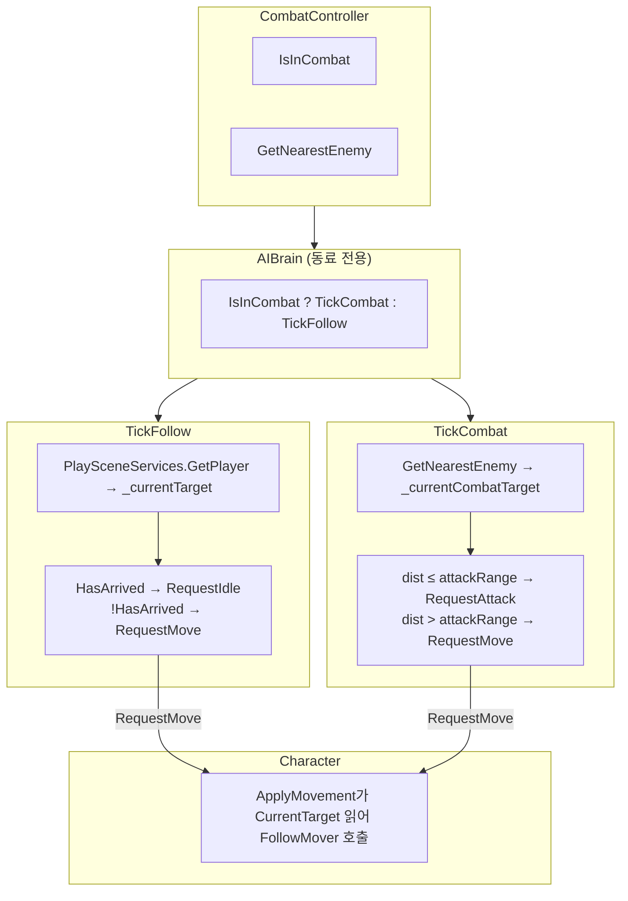
```mermaid
flowchart TB
    subgraph CombatCtrl["CombatController"]
        IsInCombat["IsInCombat"]
        GetNearest["GetNearestEnemy"]
    end

    subgraph AIBrain["AIBrain (동료 전용)"]
        Branch["IsInCombat ? TickCombat : TickFollow"]
    end

    subgraph TickFollow["TickFollow"]
        TF1["PlaySceneServices.GetPlayer → _currentTarget"]
        TF3["HasArrived → RequestIdle<br/>!HasArrived → RequestMove"]
    end

    subgraph TickCombat["TickCombat"]
        TC1["GetNearestEnemy → _currentCombatTarget"]
        TC3["dist ≤ attackRange → RequestAttack<br/>dist &gt; attackRange → RequestMove"]
    end

    subgraph Char["Character"]
        ApplyMove["ApplyMovement가 CurrentTarget 읽어 FollowMover 호출"]
    end

    CombatCtrl --> AIBrain
    AIBrain --> TickFollow
    AIBrain --> TickCombat
    TF1 --> TF3
    TC1 --> TC3
    TF3 -->|RequestMove| ApplyMove
    TC3 -->|RequestMove| ApplyMove
```

**SetFollowTarget**: SquadController가 플레이어 변경 시 Character → AIBrain.SetFollowTarget(플레이어) 호출. 따라갈 대상 설정.

| 구분 | 내용 |
|------|------|
| **문제** | 동료가 플레이어처럼 입력을 받지 않아, 전투 시 추적·사거리 판단·공격 시점을 자동으로 결정해야 함 |
| **해결** | CombatController(전투 상태, GetNearestEnemy) 기반 AIBrain. IsInCombat으로 TickFollow/TickCombat 분기. Follow 시 PlaySceneServices로 플레이어 획득, Combat 시 GetNearestEnemy로 타겟. 사거리 밖이면 RequestMove, 안이면 RequestAttack. Character.ApplyMovement가 CurrentTarget을 읽어 NavMesh 기반 FollowMover.MoveToTarget 호출 |
| **결과** | 플레이어와 동일한 CharacterStateMachine·Attacker 재사용. AIBrain은 “판단”만 담당, 실행은 Character에 위임 |

---

### 2.3 시스템 간 독립성 (MVP + 조율층)

#### 도식

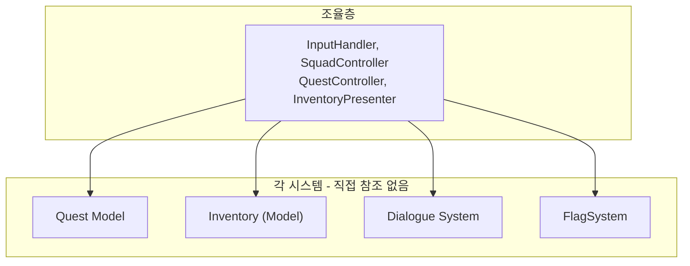
```mermaid
flowchart TB
    subgraph Coord["조율층"]
        CoordDesc["InputHandler, SquadController<br/>QuestController, InventoryPresenter"]
    end

    subgraph Systems["각 시스템 - 직접 참조 없음"]
        Quest["Quest Model"]
        Inventory["Inventory (Model)"]
        Dialogue["Dialogue System"]
        Flag["FlagSystem"]
    end

    CoordDesc --> Quest
    CoordDesc --> Inventory
    CoordDesc --> Dialogue
    CoordDesc --> Flag
```

| 구분 | 내용 |
|------|------|
| **문제** | 퀘스트·인벤토리·대화가 서로 참조하면 결합도 증가, 수정 범위 확대 |
| **해결** | 퀘스트·인벤토리·대화는 Model/View 분리. PlayScene·PlaySaveCoordinator 등 조율층이 이벤트 구독 후 의존성 주입·호출 |
| **결과** | 퀘스트 추가·수정 시 인벤토리·대화 코드를 건드리지 않고 변경 가능 |

---

### 2.4 세이브/로드 Contributor 패턴

#### 도식

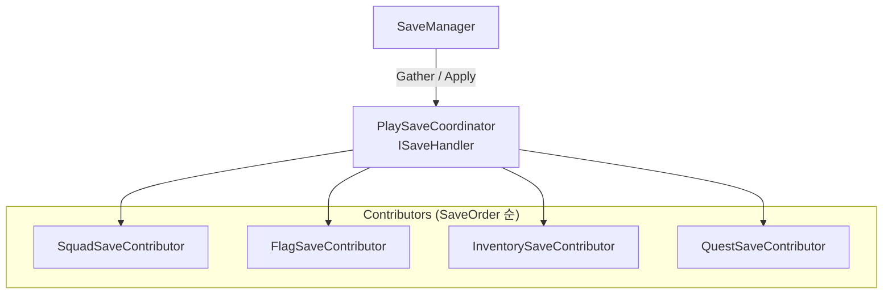
```mermaid
flowchart TB
    SaveManager["SaveManager"]
    PSC["PlaySaveCoordinator<br/>ISaveHandler"]

    subgraph Contrib["Contributors (SaveOrder 순)"]
        Squad["SquadSaveContributor"]
        Flag["FlagSaveContributor"]
        Inv["InventorySaveContributor"]
        Quest["QuestSaveContributor"]
    end

    SaveManager -->|"Gather / Apply"| PSC
    PSC --> Squad
    PSC --> Flag
    PSC --> Inv
    PSC --> Quest
```

| 구분 | 내용 |
|------|------|
| **문제** | 세이브 대상이 늘어날 때마다 조율층이 모든 시스템을 알아야 함 |
| **해결** | `ISaveHandler` + `SaveContributorBehaviour` 기반. PlaySaveCoordinator가 Contributor 목록 보유, 각 Contributor가 Gather/Apply만 구현. SaveOrder로 적용 순서 보장 |
| **결과** | 새 저장 대상 추가 시 Contributor 생성 후 PlaySaveCoordinator에 등록하면 되고, SaveManager 수정 불필요 |

---

### 2.5 대화·퀘스트 데이터(Scriptable Object) 기반 연동

#### 도식

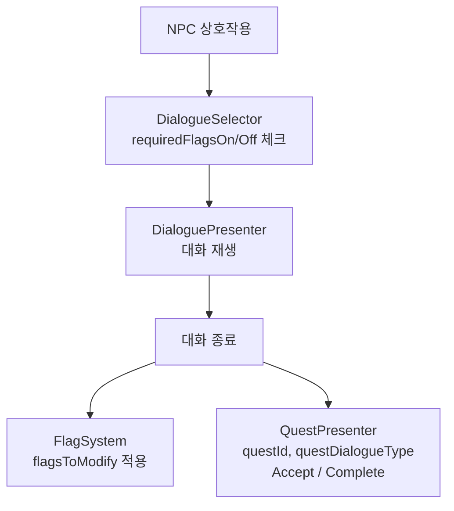
```mermaid
flowchart TB
    NPC["NPC 상호작용"]
    Selector["DialogueSelector<br/>requiredFlagsOn/Off 체크"]
    Presenter["DialoguePresenter<br/>대화 재생"]
    End["대화 종료"]

    Flag["FlagSystem<br/>flagsToModify 적용"]
    Quest["QuestPresenter<br/>questId, questDialogueType<br/>Accept / Complete"]

    NPC --> Selector
    Selector --> Presenter
    Presenter --> End
    End --> Flag
    End --> Quest
```

| 구분 | 내용 |
|------|------|
| **문제** | 대화 분기·퀘스트 수락/완료를 하드코딩하면 시나리오 추가가 어려움 |
| **해결** | DialogueData(ScriptableObject)에 `requiredFlagsOn/Off`(선택 조건), `flagsToModify`(종료 시 플래그), `questId`·`questDialogueType`(수락/완료)로 정의. 시나리오 설계자는 에셋만 수정 |
| **결과** | 코드 수정 없이 대화·퀘스트 흐름 추가·변경 가능 |

---

## 3. 전체 시스템 아키텍처

> PlayScene이 조율층으로, 모든 시스템을 연결·초기화·이벤트 구독한다.

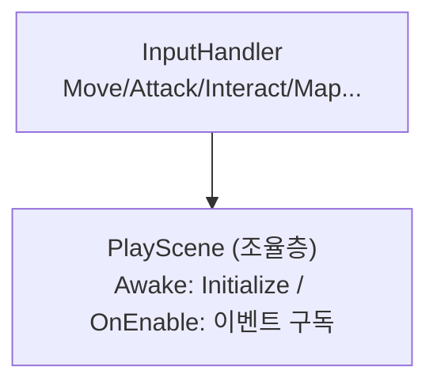
```mermaid
flowchart TB
    Input["InputHandler<br/>Move/Attack/Interact/Map..."]
    PlayScene["PlayScene (조율층)<br/>Awake: Initialize / OnEnable: 이벤트 구독"]

    Input --> PlayScene
```

PlayScene은 SquadController, EnemySpawner, CombatController, InventoryPresenter, DialogueController, QuestController, MapController, PortalController, CursorController, SettingsView, PlaySaveCoordinator 등 다양한 시스템 간의 연결·조율을 담당한다.

### 3.1 분대·캐릭터 시스템

Character는 **컴포넌트화**되어 있다. 한 오브젝트에 Model·Mover·Animator·Interactor·Attacker·StateMachine 등 여러 컴포넌트를 조합하고, Request API로 외부(InputHandler, AIBrain)와 통일된 방식으로 연동한다.

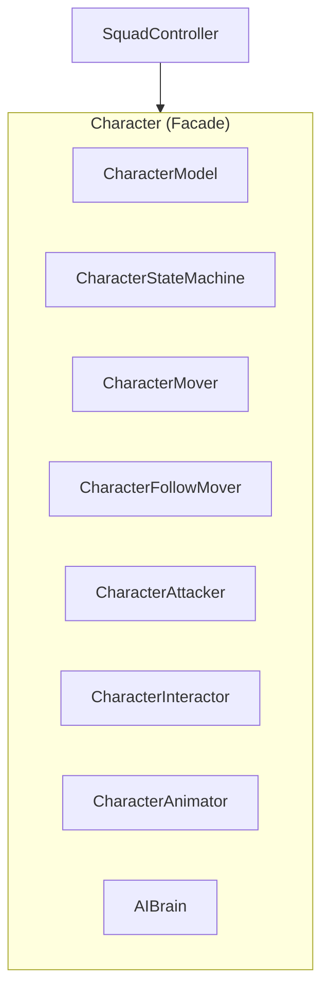
```mermaid
flowchart TB
    subgraph Character["Character (Facade)"]
        Model["CharacterModel"]
        StateMachine["CharacterStateMachine"]
        Mover["CharacterMover"]
        FollowMover["CharacterFollowMover"]
        Attacker["CharacterAttacker"]
        Interactor["CharacterInteractor"]
        Animator["CharacterAnimator"]
        AIBrain["AIBrain"]
    end

    Squad["SquadController"]
    Squad --> Character
```

**주요 컴포넌트**
| 컴포넌트 | 역할 |
|----------|------|
| Character | Facade. Request API 제공. Model·StateMachine·Mover·Attacker·Interactor·Animator·AIBrain 등 조합 |
| CharacterModel | HP, 스탯, CharacterData 보유 |
| CharacterStateMachine | Idle·Move·Attack·Dead 상태 관리 |
| CharacterMover | 플레이어용 방향 이동 |
| CharacterFollowMover | 동료용 NavMesh 목표 이동 |
| CharacterAttacker | 공격 로직·사거리 판단 |
| CharacterInteractor | IInteractReceiver. 상호작용 수신 |
| CharacterAnimator | 애니메이션 연동 |
| AIBrain | 동료 전용. TickFollow/TickCombat |
| SquadController | 분대 스폰, 플레이어/동료 관리, SetFollowTarget |

Request API·ApplyMovement 분기·통합 상태머신 등 상세는 2.1 참조.

### 3.2 전투·적 시스템

Enemy도 Character처럼 **컴포넌트화**되어 있다.

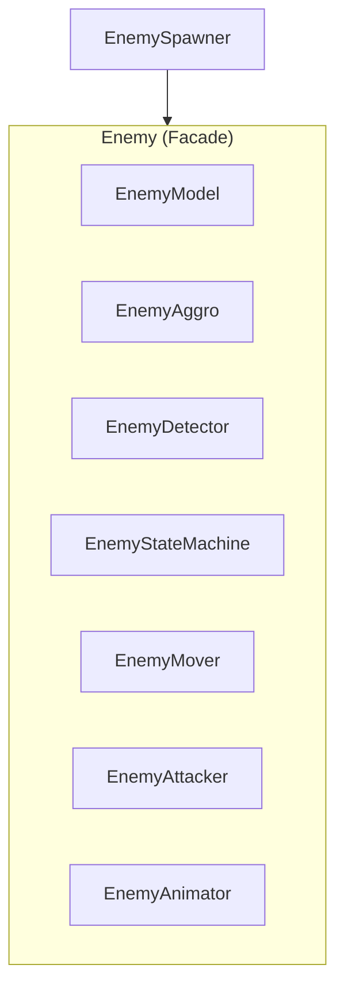
```mermaid
flowchart TB
    subgraph Enemy["Enemy (Facade)"]
        EModel["EnemyModel"]
        EAggro["EnemyAggro"]
        EDetector["EnemyDetector"]
        ESM["EnemyStateMachine"]
        EMover["EnemyMover"]
        EAttacker["EnemyAttacker"]
        EAnimator["EnemyAnimator"]
    end

    Spawner["EnemySpawner"]
    Spawner --> Enemy
```

**주요 컴포넌트**
| 컴포넌트 | 역할 |
|----------|------|
| Enemy | Facade. Model·Aggro·Detector·StateMachine·Mover·Attacker·Animator 등 조합 |
| EnemyModel | HP, 스탯, EnemyData. 어그로 수치·탐지 반경 등 |
| EnemyDetector | Physics.OverlapSphere로 반경 내 Character 감지. OnCharacterDetected 발행 |
| EnemyAggro | 거리별 어그로 누적. HasAnyAboveThreshold, GetHighestAggroTarget |
| EnemyStateMachine | Idle·Patrol·Chase·Attack·Dead. 어그로 임계값 초과 시 전투 진입 |
| EnemyMover | NavMesh 기반 이동 |
| EnemyAttacker | 공격·Hitbox 연동 |
| CombatController | 전투 중인 Enemy 목록 관리. IsInCombat, GetNearestEnemy. AIBrain에 주입 |

**전투 연계** EnemyDetector가 분대(Character) 감지 → EnemyAggro에 어그로 누적 → 임계값 초과 시 EnemyStateMachine이 Chase/Attack 진입 → CombatController에 등록 → AIBrain이 IsInCombat·GetNearestEnemy로 동료 전투 판단(TickCombat). SquadController.Initialize(combatController)로 AIBrain에 CombatController 주입. 적 사망 시 HandleDeath → 3초 후 Destroy, _dropPrefab 드롭.

### 3.3 인벤토리 시스템

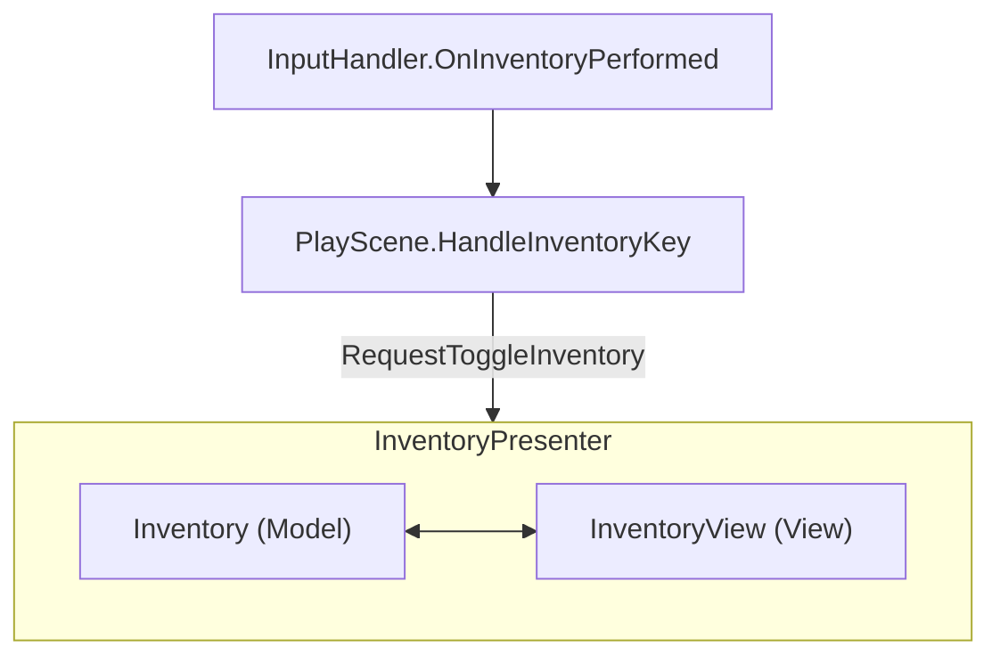
```mermaid
flowchart TB
    Input["InputHandler.OnInventoryPerformed"]
    PlayScene["PlayScene.HandleInventoryKey"]

    subgraph Presenter["InventoryPresenter"]
        Model["Inventory (Model)"]
        View["InventoryView (View)"]
    end

    Input --> PlayScene
    PlayScene -->|"RequestToggleInventory"| Presenter
    Model <--> View
```

**주요 컴포넌트**
| 컴포넌트 | 역할 |
|----------|------|
| InventoryPresenter | Model·View 연결. RequestToggleInventory, SetPlayerCharacter. OnUseItemRequested→TryUseItem, OnDropEnded→SwapItems |
| Inventory | 슬롯 배열, AddItem, SetItemUser, TryUseItem, SwapItems. GameEvents.OnItemPickedUp 구독. Quest 완료 시 아이템 차감 |
| InventoryView | UI 표시. OnUseItemRequested, OnDropEnded, OnRefreshRequested. ToggleInventory |

PlayScene.HandlePlayerChanged → InventoryPresenter.SetPlayerCharacter (플레이어 변경 시 소비품 효과 대상 ItemUser 갱신)

### 3.4 대화 시스템

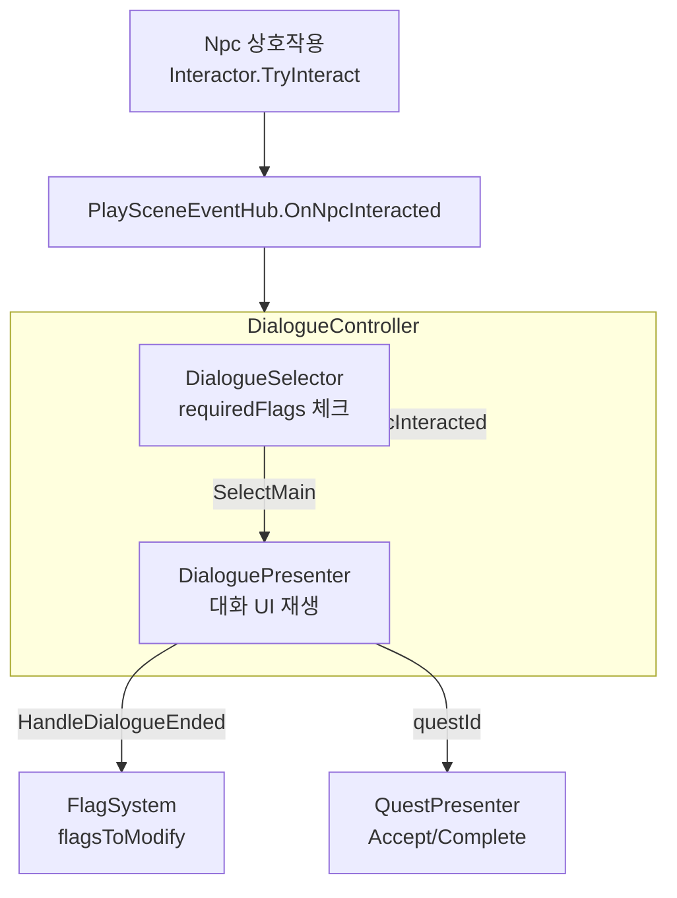
```mermaid
flowchart TB
    NPC["Npc 상호작용<br/>Interactor.TryInteract"]
    EventHub["PlaySceneEventHub.OnNpcInteracted"]

    subgraph DC["DialogueController"]
        Selector["DialogueSelector<br/>requiredFlags 체크"]
        Presenter["DialoguePresenter<br/>대화 UI 재생"]
    end

    Flag["FlagSystem<br/>flagsToModify"]
    Quest["QuestPresenter<br/>Accept/Complete"]

    NPC --> EventHub
    EventHub --> DC
    DC -->|"HandleNpcInteracted"| Selector
    Selector -->|"SelectMain"| Presenter
    Presenter -->|"HandleDialogueEnded"| Flag
    Presenter -->|"questId"| Quest
```

**주요 컴포넌트**
| 컴포넌트 | 역할 |
|----------|------|
| DialogueController | PlaySceneEventHub.OnNpcInteracted 구독. Selector.SelectMain → Presenter.RequestStartDialogue. HandleDialogueEnded → ApplyFlags, RequestQuestAction |
| DialogueSelector | DataManager·FlagSystem 기반. SelectMain(npcId): requiredFlagsOn/Off 체크 후 재생할 대화 1개 선택. GetAvailableQuests |
| DialoguePresenter | DialogueSystem↔DialogueView 연결. RequestStartDialogue, OnDialogueEnded 발행 |
| DialogueSystem | 대화 상태·진행. StartDialogue |
| DialogueView | 대화 UI. OnNextClicked, OnEndClicked, OnQuestDialogueSelected |
| FlagSystem | flagsToModify 적용 (Set/Add) |
| QuestPresenter | questId·questDialogueType에 따라 RequestAcceptQuest, RequestCompleteQuest |

끝내기 버튼: 타이핑 중 첫 클릭=스킵, 두 번째 클릭=대화 종료

### 3.5 퀘스트 시스템

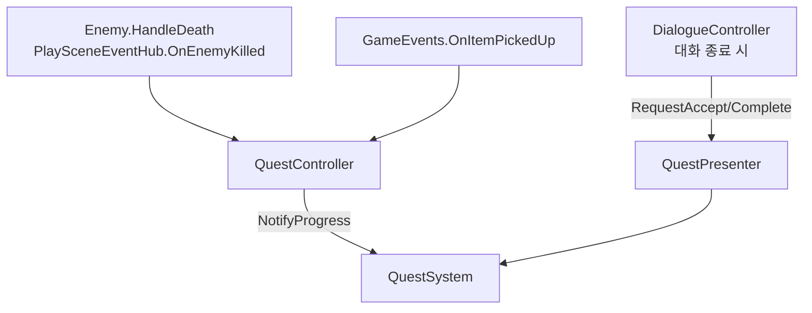
```mermaid
flowchart TB
    EnemyKilled["Enemy.HandleDeath<br/>PlaySceneEventHub.OnEnemyKilled"]
    ItemPicked["GameEvents.OnItemPickedUp"]
    Dialogue["DialogueController<br/>대화 종료 시"]

    QC["QuestController"]
    QP["QuestPresenter"]
    QS["QuestSystem"]

    EnemyKilled --> QC
    ItemPicked --> QC
    QC -->|"NotifyProgress"| QS
    Dialogue -->|"RequestAccept/Complete"| QP
    QP --> QS
```

**주요 컴포넌트**
| 컴포넌트 | 역할 |
|----------|------|
| QuestController | OnEnemyKilled, OnItemPickedUp 구독 → QuestSystem.NotifyProgress. OnQuestUpdated: 목표 달성 플래그, Gather 시 인벤토리 동기화. OnQuestCompleted: 완료 플래그, Gather 아이템 차감, RecruitmentQuestData면 AddCompanion |
| QuestPresenter | QuestSystem↔QuestView 연결. RequestAcceptQuest, RequestCompleteQuest. DialogueController에 주입 |
| QuestSystem | NotifyProgress(targetId), AcceptQuest, CompleteQuest. OnQuestUpdated, OnQuestCompleted |

**동료 영입** RecruitmentQuestData: 퀘스트 완료 시 `recruitCharacterId`로 CharacterData 참조해 SquadController.AddCompanion 호출. 대화·퀘스트 완료 플래그(`quest_*_completed`)로 수락 대화 재표시 여부 제어.

### 3.6 맵 시스템

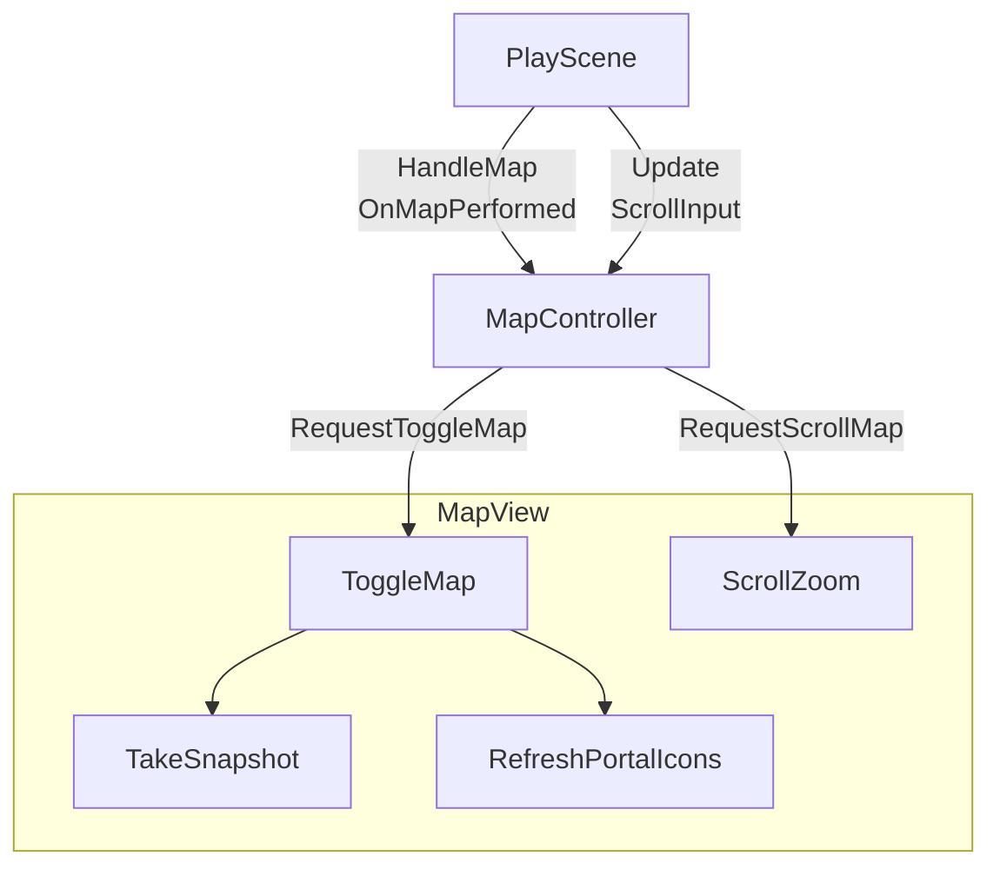
```mermaid
flowchart TB
    PlayScene["PlayScene"]
    MController["MapController"]

    subgraph MapView["MapView"]
        Toggle["ToggleMap"]
        Scroll["ScrollZoom"]
        Snapshot["TakeSnapshot"]
        Portals["RefreshPortalIcons"]
    end

    PlayScene -->|"HandleMap<br/>OnMapPerformed"| MController
    PlayScene -->|"Update<br/>ScrollInput"| MController
    MController -->|"RequestToggleMap"| Toggle
    MController -->|"RequestScrollMap"| Scroll
    Toggle --> Snapshot
    Toggle --> Portals
```

**주요 컴포넌트**
| 컴포넌트 | 역할 |
|----------|------|
| MapController | RequestToggleMap, RequestScrollMap. MapView에 위임. Initialize(PortalController, Character, SquadController) |
| MapView | ToggleMap(패널 On/Off), ScrollZoom(마우스 휠), TakeSnapshot, RefreshPortalIcons. MapCamera(RenderTexture 스냅샷), PortalController(해금 포탈), SquadController(플레이어 위치) 참조. Update에서 플레이어 아이콘 실시간 갱신 |

### 3.7 포탈 시스템

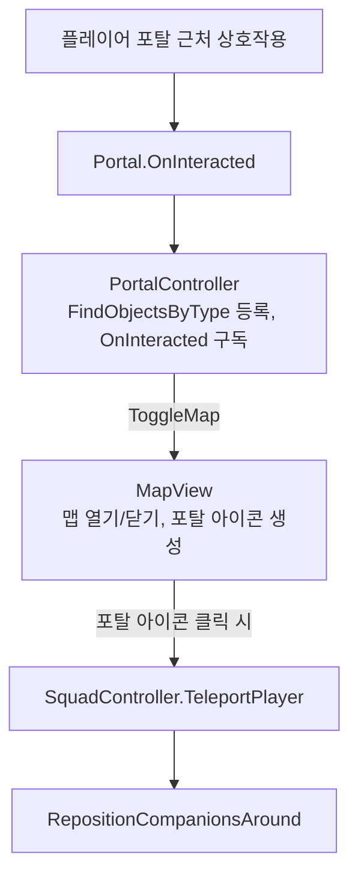
```mermaid
flowchart TB
    A["플레이어 포탈 근처 상호작용"]

    Portal["Portal.OnInteracted"]

    PController["PortalController<br/>FindObjectsByType 등록, OnInteracted 구독"]
    MapView["MapView<br/>맵 열기/닫기, 포탈 아이콘 생성"]

    Teleport["SquadController.TeleportPlayer"]
    Repos["RepositionCompanionsAround"]

    A --> Portal
    Portal --> PController
    PController -->|"ToggleMap"| MapView

    MapView -->|"포탈 아이콘 클릭 시"| Teleport
    Teleport --> Repos
```

**주요 컴포넌트**
| 컴포넌트 | 역할 |
|----------|------|
| Portal | IInteractable. Interact 시 OnInteracted(IInteractReceiver, Portal) 발행. PortalData 표시용, ArrivalPosition 제공 |
| PortalDetector | OnTriggerStay/Exit로 반경 내 플레이어 감지. Portal에 연결되어 PortalEffect 토글 |
| PortalController | FindObjectsByType으로 포탈 등록, Portal.OnInteracted 구독. HandlePortalInteracted에서 MapView.ToggleMap 호출. PortalModel 목록 유지 |
| PortalModel | Portal + FlagSystem. 해금 여부 관리. MapView에서 해금된 포탈만 아이콘 표시 |
| MapView | Map_PortalIcon 생성(해금된 PortalModel만). OnPortalClicked 시 SquadController.TeleportPlayer 호출 후 맵 닫기 |
| SquadController | TeleportPlayer(ArrivalPosition), TeleportToDefaultPoint(끼임 탈출), RepositionCompanionsAround |

---

## 4. 부록: 사용 에셋

본 프로젝트에서 사용한 Asset Store 에셋 목록

| 에셋 (폴더) | 사용 용도 |
|-------------|-----------|
| FemaleAssasin | 캐릭터 모델·애니메이션 |
| PicoChan | 캐릭터 모델 |
| SapphiArtchan | 캐릭터 모델 |
| Stellar Girl Celeste | 캐릭터 모델 |
| Monster_Wolf | 적(늑대) 모델 |
| Space_Exploration_GUI_Kit | UI (인벤토리, 퀘스트 등) |
| Classic_RPG_GUI | UI 부품 |
| RunesAndPortals | 포탈·이펙트 |
| Town | 마을 맵·환경 |
| Lowpoly_Environments | 맵·환경 |
| Lowpoly_Demos | 데모 맵 |
| Lowpoly_Village | 마을 오브젝트 |
| Fruits and Vegetables | 오브젝트 |
| FREE Food Pack | 음식 오브젝트 |
| Sci-fi Sword | 무기 |
| Stylized Fantasy Weapons Pack | 무기 모델 |
| CharacterAnimation / Human Animations | 애니메이션 |
| DOTween (Plugins) | 트윈 애니메이션 |

---

## 5. 사용 Tool

### 5.1 개발
| Tool | 버전/내용 |
|------|-----------|
| **Unity** | 6000.0.59f2 (Unity 6) |
| **Git** | 버전 관리 |
| **Cursor** | AI 기반 코드 에디터 (개발·리팩터링 보조) |

개발 시 Unity 에디터 전용 디버깅 기능(Squad, Quest, Inventory, Portal 등)을 사용함.

**디버거 인스펙터 뷰**

| Squad | Quest | Inventory |
|:---:|:---:|:---:|
|  |  |  |

| Portal | EnemySpawner | Flag |
|:---:|:---:|:---:|
|  |  |  |

**주요 패키지**
- Unity AI Navigation 2.0.9
- Cinemachine 3.1.5
- Input System 1.14.0
- Universal RP 17.1.0

### 5.2 제작·문서
| Tool | 용도 |
|------|------|
| **Capcut** | 영상 편집 |
| **Notion** | 개발일지·문서 정리 |

