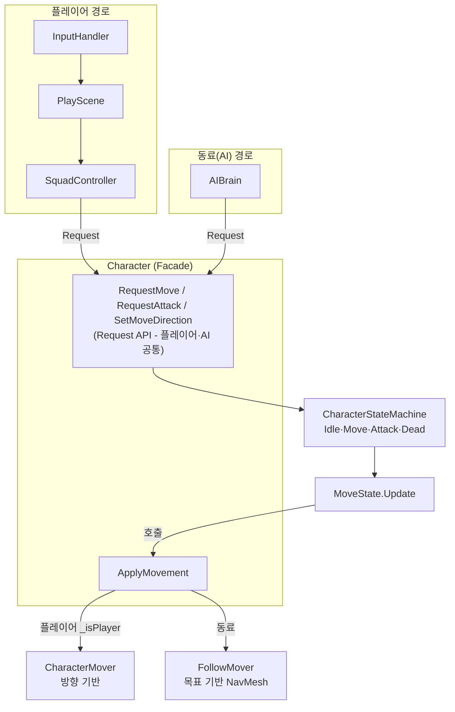
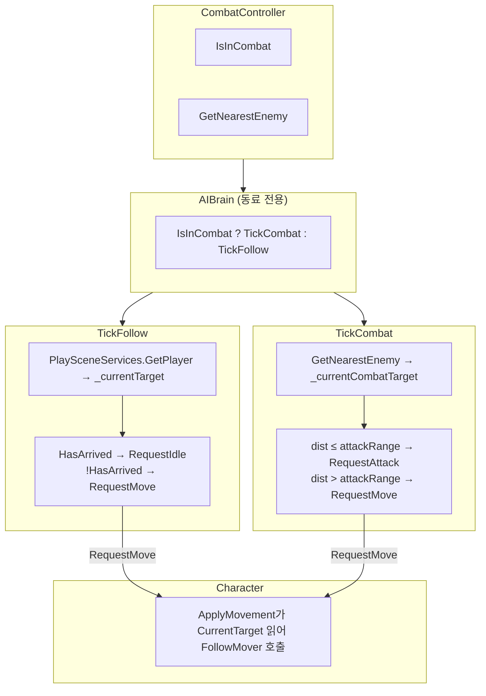
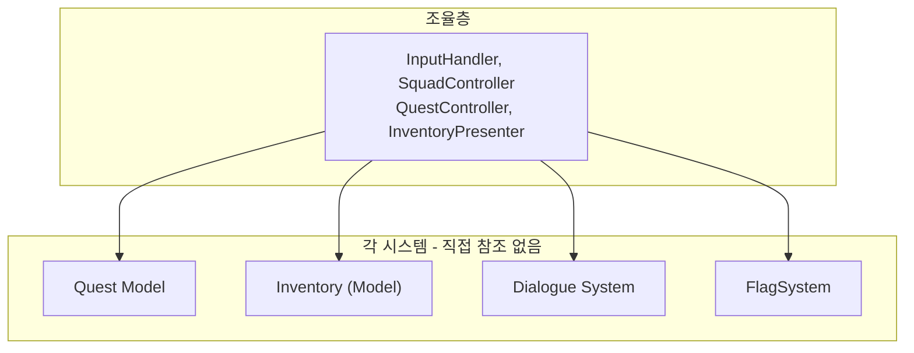

# Squad System Framework

> 분대 시스템 기반 3인칭 RPG 개발 문서

---

## 1. 프로젝트 소개

### 1.1 게임 개요

**Squad System Framework**는 **분대 시스템 기반 3인칭 RPG 프레임워크**입니다.

- **플레이어·동료 분대**: 한 명을 조종하고, 나머지는 AI가 따라오며 전투에 참여
- **분대 교체(Swap)**: 조종 대상을 순환 전환
- **동료 영입**: 퀘스트 완료 시 NPC를 분대에 영입
- **적 전투**: 분대 vs 적 팀, 어그로, 처치 퀘스트 연동
- **대화**: NPC 상호작용, 플래그 기반 대화 분기
- **퀘스트**: 수집·처치·영입, 진행도·완료 분기
- **인벤토리**: 아이템 수집·보관
- **아이템 사용**: 회복 아이템 등, 조종 중인 캐릭터에 적용
- **포탈·맵**: 근접 이펙트, 해금 아이콘 표시, 지도 클릭 순간이동, 스크롤·줌
- **사망·리스폰**: 마을 고정 위치에서 부활
- **세이브/로드**: 분대 구성, 퀘스트, 인벤토리, 플래그, 캐릭터 위치·조종 캐릭터 저장

### 1.2 게임 이미지

<table>
<tr>
<td><strong>인트로</strong><br></td>
<td><strong>분대 따라오기</strong><br></td>
</tr>
<tr>
<td><strong>분대 전투</strong><br></td>
<td><strong>대화·퀘스트</strong><br></td>
</tr>
<tr>
<td><strong>동료 영입 완료</strong><br></td>
<td><strong>인벤토리</strong><br></td>
</tr>
<tr>
<td><strong>지도</strong><br></td>
<td><strong>포탈</strong><br></td>
</tr>
</table>

### 1.3 영상

[🎬 영상 보기](https://youtu.be/l2WycMeBfec)

---

## 2. 핵심 기술 항목

### 2.1 분대·캐릭터 통합 상태머신

#### 도식



#### 문제 → 해결 → 결과

| 구분 | 내용 |
|------|------|
| **문제** | 플레이어(방향 이동)와 동료(목표 추적)의 이동 방식이 달라, 동일한 StateMachine으로 통합하기 어려움 |
| **해결** | RequestMove/RequestAttack 등 Request API는 플레이어·동료 공통. 이동 실행부만 분리: CharacterMover(방향)와 CharacterFollowMover(목표)를 두고, ApplyMovement에서 `_isPlayer`로 분기해 플레이어는 CharacterMover, 동료는 FollowMover 호출 |
| **결과** | 하나의 `CharacterStateMachine`(Idle·Move·Attack·Dead)으로 플레이어·동료 모두 처리. 플레이어는 입력→Request, 동료는 AIBrain→Request로 같은 API 사용. MoveState.Update에서 ApplyMovement 호출, 플레이어=SetMoveDirection·CharacterMover, 동료=AIBrain.CurrentTarget·FollowMover(NavMesh) |

---

### 2.2 AIBrain / 동료 AI

#### 도식



**SetFollowTarget**: SquadController가 플레이어 변경 시 Character → AIBrain.SetFollowTarget(플레이어) 호출. 따라갈 대상 설정.

#### 문제 → 해결 → 결과

| 구분 | 내용 |
|------|------|
| **문제** | 동료가 플레이어처럼 입력을 받지 않아, 전투 시 추적·사거리 판단·공격 시점을 자동으로 결정해야 함 |
| **해결** | CombatController(전투 상태, GetNearestEnemy) 기반 AIBrain. IsInCombat으로 TickFollow/TickCombat 분기. Follow 시 PlaySceneServices로 플레이어 획득, Combat 시 GetNearestEnemy로 타겟. 사거리 밖이면 RequestMove, 안이면 RequestAttack. Character.ApplyMovement가 CurrentTarget을 읽어 NavMesh 기반 FollowMover.MoveToTarget 호출 |
| **결과** | 플레이어와 동일한 CharacterStateMachine·Attacker 재사용. AIBrain은 “판단”만 담당, 실행은 Character에 위임 |

---

### 2.3 시스템 간 독립성 (MVP + 조율층) (3순위)

#### 도식



#### 문제 → 해결 → 결과

| 구분 | 내용 |
|------|------|
| **문제** | 퀘스트·인벤토리·대화가 서로 참조하면 결합도 증가, 수정 범위 확대 |
| **해결** | 퀘스트·인벤토리·대화는 Model/View 분리. PlayScene·PlaySaveCoordinator 등 조율층이 이벤트 구독 후 의존성 주입·호출 |
| **결과** | 퀘스트 추가·수정 시 인벤토리·대화 코드를 건드리지 않고 변경 가능 |

---

### 2.4 세이브/로드 Contributor 패턴 (4순위)

#### 도식

```
SaveManager
    │
    ├─ Gather() ──► SquadSaveContributor
    │               FlagSaveContributor
    │               InventorySaveContributor
    │               QuestSaveContributor
    │
    └─ Apply() ──► (동일 순서로 로드)
```

#### 문제 → 해결 → 결과

| 구분 | 내용 |
|------|------|
| **문제** | 세이브 대상이 늘어날 때마다 SaveManager가 모든 시스템을 알아야 함 |
| **해결** | `ISaveHandler` + `SaveContributorBehaviour` 기반. 각 Contributor가 Gather/Apply만 구현, SaveOrder로 의존 순서 보장 |
| **결과** | 새 저장 대상 추가 시 새 Contributor만 추가하면 되고, SaveManager 수정 불필요 |

---

### 2.5 플래그·대화·퀘스트 연동 (5순위)

#### 도식

```
NPC 상호작용
    │
    ▼
DialogueSelector ──► requiredFlagsOn/Off 체크
    │
    ▼
대화 재생 (DialogueSystem)
    │
    ▼
대화 종료 ──► flagsToModify / QuestSystem.AcceptQuest·CompleteQuest
```

#### 문제 → 해결 → 결과

| 구분 | 내용 |
|------|------|
| **문제** | 대화 분기·퀘스트 수락/완료를 하드코딩하면 시나리오 추가가 어려움 |
| **해결** | DialogueData에 `requiredFlagsOn/Off`, `flagsToModify`, `questId` 등 데이터로 정의. 시나리오 설계자는 ScriptableObject만 수정 |
| **결과** | 코드 수정 없이 대화·퀘스트 흐름 추가·변경 가능 |

---

## 3. 전체 시스템 아키텍처

> PlayScene이 조율층으로, 모든 시스템을 연결·초기화·이벤트 구독한다.

### 3.1 PlayScene과 시스템 연결도

```
                              ┌─────────────────────┐
                              │     InputHandler    │
                              └──────────┬──────────┘
                                         │ Move/Attack/Interact/Map/...
                                         ▼
┌──────────────────────────────────────────────────────────────────────────────────────────────┐
│                              PlayScene (조율층)                                                │
│  Awake: Initialize / OnEnable: 이벤트 구독 / Update: MoveInput / CursorController, SettingsView │
└──────────────────────────────────────────────────────────────────────────────────────────────┘
    │         │         │         │         │         │         │         │         │         │         │
    ▼         ▼         ▼         ▼         ▼         ▼         ▼         ▼         ▼         ▼         ▼
┌───────┐ ┌───────┐ ┌───────┐ ┌───────┐ ┌───────┐ ┌───────┐ ┌───────┐ ┌───────┐ ┌───────┐ ┌───────┐ ┌───────┐
│Squad  │ │Enemy  │ │Combat │ │Inventory│ │Dialogue│ │Quest  │ │Map    │ │Portal │ │Cursor │ │Settings│ │PlaySave│
│Ctrl   │ │Spawner│ │Ctrl   │ │Present │ │Ctrl   │ │Ctrl   │ │Ctrl   │ │Ctrl   │ │Ctrl   │ │View    │ │Coord  │
└───┬───┘ └───┬───┘ └───┬───┘ └───┬───┘ └───┬───┘ └───┬───┘ └───┬───┘ └───┬───┘ └───┬───┘ └───┬───┘ └───┬───┘
    │         │         │         │         │         │         │         │         │
    │         └────┬────┘         │         │         │         │         │         │
    │              │              │         │         └────┬────┴─────────┘         │
    │              │              │         │              │   FlagSystem           │
    │              │              │         │              │   PlaySceneEventHub    │
    ▼              ▼              ▼         ▼              ▼                       ▼
 Character     Enemy          AIBrain   Inventory      Dialogue               SaveManager
 (Player/      (Chase/        (Follow/  (Model+View)   (Selector+             (Contributors)
  Companion)    Attack)        Combat)                  Presenter)
```

**추가 연동**
- **CursorController**: UI 열기/닫기 시 커서 표시, Cinemachine 카메라 회전값 저장·복원, InputAxisController 비활성화(UI 열린 동안 카메라 회전 차단)
- **SettingsView**: OnEscapeRequested → PlayScene → SquadController.TeleportToDefaultPoint(끼임 탈출)

### 3.2 포탈 시스템

```
[플레이어가 포탈 근처에서 상호작용(IInteractable)]  또는  [맵 UI에서 Map_PortalIcon 클릭]
                    │
    ┌───────────────┼───────────────┐
    ▼                               ▼
Portal.OnInteracted(IInteractReceiver, Portal)   Map_PortalIcon.OnPortalClicked
    │                               │
    ▼                               │
PortalController (FindObjectsByType으로 포탈 등록, OnInteracted 구독)
    │                               │
    └───────────────┬───────────────┘
                    ▼
        MapView (맵 열기/닫기, 포탈 아이콘 생성)
                    │
                    ▼ (맵에서 포탈 아이콘 클릭 시)
        SquadController.TeleportPlayer(ArrivalPosition)
        (설정 끼임 탈출: TeleportToDefaultPoint → _spawnPoint)
                    │
                    ▼
        플레이어·동료 전체 Teleport → RepositionCompanionsAround
```

**주요 컴포넌트**
| 컴포넌트 | 역할 |
|----------|------|
| Portal | IInteractable. TryInteract 시 OnInteracted(IInteractReceiver, Portal) 발행. PortalData로 ArrivalPosition 제공 |
| PortalDetector | 반경 내 플레이어 감지, PortalEffect 토글 |
| PortalController | FindObjectsByType으로 포탈 등록, OnInteracted 구독, PortalModel 목록 유지 |
| PortalModel | Portal + FlagSystem 기반 해금 여부 |
| MapView | Map_PortalIcon 생성, OnPortalClicked 시 TeleportPlayer 호출 |
| SquadController | TeleportPlayer, TeleportToDefaultPoint(끼임 탈출), RepositionCompanionsAround, AddCompanion(영입) |

### 3.3 맵 시스템

```
PlayScene.Update ──► MapController.RequestScrollMap(scrollInput)
PlayScene.HandleMap ──► MapController.RequestToggleMap()
                              │
                              ▼
┌─────────────────────────────────────────────────────────────┐
│                      MapView                                 │
│  ToggleMap: 패널 On/Off, TakeSnapshot, RefreshPortalIcons   │
│  ScrollZoom: 마우스 휠로 지도 줌                             │
│  Update: 플레이어 아이콘 위치·회전 실시간 갱신                │
└─────────────────────────────────────────────────────────────┘
        │                    │                    │
        ▼                    ▼                    ▼
  MapCamera             PortalController     SquadController
  (RenderTexture        (해금 포탈 목록)       (플레이어 위치)
   스냅샷)
```

### 3.4 인벤토리 시스템

```
InputHandler.OnInventoryPerformed  ←── PlayScene.HandleInventoryKey
                    │
                    ▼
┌─────────────────────────────────────────────────────────────┐
│                 InventoryPresenter                           │
│  Model(Inventory) ←→ View(InventoryView) 연결                │
│  SetPlayerCharacter: 소비품 효과 대상(ItemUser) 갱신          │
└─────────────────────────────────────────────────────────────┘
        │                              │
        ▼                              ▼
  Inventory (Model)              InventoryView
  - Slots, AddItem,             - UI 표시, OnUseItemRequested,
    SetItemUser                   OnDropEnded
  - Quest 완료 시 아이템 차감
```

**PlayScene 연동**: HandlePlayerChanged → InventoryPresenter.SetPlayerCharacter (플레이어 변경 시 ItemUser 갱신)

### 3.5 대화 시스템

```
Npc 상호작용 (Interactor.TryInteract)
                    │
                    ▼
PlaySceneEventHub.OnNpcInteracted(npcId)
                    │
                    ▼
┌─────────────────────────────────────────────────────────────┐
│                 DialogueController                           │
│  HandleNpcInteracted → Selector.SelectMain → Presenter 시작  │
│  HandleDialogueEnded → ApplyFlags + Quest Accept/Complete    │
└─────────────────────────────────────────────────────────────┘
        │                    │                    │
        ▼                    ▼                    ▼
  DialogueSelector      DialoguePresenter    FlagSystem
  (requiredFlags 체크)   (대화 UI 재생)       (flagsToModify)
                              │
                              ▼
                        QuestPresenter
                        (questId 있으면 Accept/Complete)
```

**대화 UX**: 끝내기 버튼 — 타이핑 중 첫 클릭=스킵(텍스트 즉시 표시), 두 번째 클릭=대화 종료

### 3.6 퀘스트 시스템

```
PlaySceneEventHub.OnEnemyKilled(enemyId)  ←── 적 처치 시
                    │
                    ▼
┌─────────────────────────────────────────────────────────────┐
│                 QuestController                              │
│  QuestPresenter 보유. DialogueController에 주입              │
│  OnEnemyKilled → 목표 타입이 Kill이면 진행도 갱신             │
└─────────────────────────────────────────────────────────────┘
        │
        ▼
  QuestPresenter / QuestSystem
  - AcceptQuest, CompleteQuest, RequestCompleteQuest
  - Gather 퀘스트 완료 시 InventoryPresenter.Model에서 아이템 차감
```

**동료 영입**
- `RecruitmentQuestData`: 퀘스트 완료 시 분대에 영입. `recruitCharacterId`로 CharacterData 참조
- `QuestController.HandleQuestCompleted`: RecruitmentQuestData면 `SquadController.AddCompanion(characterData)` 호출
- 대화·퀘스트 완료 플래그(`quest_*_completed`)로 수락 대화 재표시 여부 제어

### 3.7 전투·적 시스템

```
EnemyDetector (반경 내 Character 감지) ──► EnemyAggro에 전달
        │
        ▼
EnemyAggro (어그로 누적) ──► 임계값 초과 시 NotifyEnteringCombat
        │
        ▼
EnemyStateMachine (Idle·Patrol·Chase·Attack·Dead) ──► NotifyCombatStateChanged
        │
        ▼
CombatController.RegisterInCombat(Enemy) / UnregisterFromCombat
        │
        ▼
AIBrain (동료) ──► IsInCombat ? TickCombat() : TickFollow()
```

**PlayScene 연동**: SquadController.Initialize(combatController) → AIBrain.Initialize(combatController)

**적 사망**: Enemy.HandleDeath → 3초 후 Destroy, _dropPrefab(Meat 등) 드롭

---

## 4. 부록: 사용 에셋

> Asset Store 에셋명과 사용 용도를 정리해 두세요.

| 에셋 (폴더/추정명) | 사용 용도 |
|--------------------|-----------|
| FemaleAssasin (Female Assassin?) | 캐릭터 모델·애니메이션 |
| PicoChan | 캐릭터 모델 |
| SapphiArtchan | 캐릭터 모델 |
| Stellar Girl Celeste | 캐릭터 모델 |
| Space_Exploration_GUI_Kit | UI (인벤토리, 퀘스트 등) |
| Classic_RPG_GUI | UI 부품 |
| RunesAndPortals | 포탈·이펙트 |
| Town (Lowpoly Town?) | 마을 맵·환경 |
| Lowpoly_Environments | 맵·환경 |
| Lowpoly_Demos | 데모 맵 |
| Lowpoly_Village | 마을 오브젝트 |
| Fruits and Vegetables | 오브젝트 |
| Sci-fi Sword | 무기 |
| CharacterAnimation / Human Animations | 애니메이션 |
| DOTween (Plugins) | 트윈 애니메이션 |
| FREE Food Pack | 음식 오브젝트 |
| Stylized Fantasy Weapons Pack | 무기 모델 |

※ Asset Store 정확한 이름은 `Assets/99_StoreAssets` 구조와 패키지 설명을 기준으로 보완해 주세요.

---

## 5. 사용 Tool

### 5.1 개발
| Tool | 버전/내용 |
|------|-----------|
| **Unity** | 6000.0.59f2 (Unity 6) |
| **Git** | 버전 관리 |
| **Cursor** | AI 기반 코드 에디터 (개발·리팩터링 보조) |

**주요 패키지**
- Unity AI Navigation 2.0.9
- Cinemachine 3.1.5
- Input System 1.14.0
- Universal RP 17.1.0

### 5.2 제작·문서
| Tool | 용도 |
|------|------|
| **Capcut** | 영상 편집 |
| **Notion** | 개발일지·문서 정리 |

---

## 6. 체크리스트 (제출 전)

- [ ] 타이틀 화면·게임플레이 스크린샷 (각 1장 이상)
- [ ] 3분 이내 영상 제작·업로드
- [ ] Unity/Git/Cursor 버전 확인
- [ ] 부록 에셋 목록 정확한 이름으로 수정
- [ ] PDF 또는 웹 페이지 형태로 최종 정리
